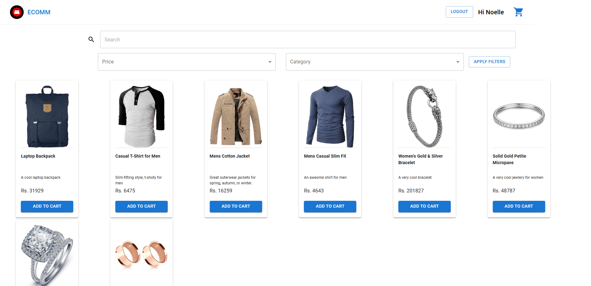

# Ecomm
---

## Introduction :



This project is an e-commerce platform built using React and Material-UI for the frontend. The application includes core functionalities like product browsing, search and filtering, cart management, and user login and registration. With a focus on clean code, modularity, and user experience, this project is designed to be both scalable and adaptable.

The application’s key features include:

- Product Browsing: Users can browse a catalog of products, search and filter them based on various criteria (price, category, etc.).

- Cart Management: Users can add products to their cart, modify quantities, and proceed to checkout.

- User Authentication: Users can sign in, register, and have their sessions persisted across page reloads using the UserContext.

- Responsive Design: The UI adapts to various screen sizes for an optimal experience on mobile, tablet, and desktop devices.

- Toast Notifications: Interactive feedback through react-toastify for success or error messages.

---

## Installation Guide : 

This guide will walk you through cloning the repository and setting up **Ecomm** on your local machine.

### Prerequisites

Before you start, ensure you have the following installed on your machine:

Git: For cloning the repository.

Node.js and npm: Required to run a React project. 

- **Git**: For cloning the repository.

- **Node.js and npm**: Required to run a React project. 

  - Check if Node.js and npm are installed:

    ```bash
    node -v
    npm -v
    ```

---

### Steps to Clone and Run the React Project 

1. Clone the Repository

- Open your terminal or command prompt.

- Navigate to the directory where you want to clone the project:

    ```bash
    cd /path/to/your/directory
    ```

- Clone the repository using Git:

    ```bash
    git clone https://github.com/thaminiperera/ecomm.git
    ```

- Navigate into the project directory:

    ```bash
    cd ecomm
    ```

2. Install Dependencies

- React projects use npm or yarn to manage dependencies. Run the following command to install all necessary packages:

    ```bash
    npm install
    ```

- If the project uses Yarn instead of npm, use:

    ```bash
    yarn install
    ```

3. Start the Development Server

- Run the following command to start the development server:

    ```bash
    npm run dev
    ```

- Or, if using Yarn:

    ```bash
    yarn start
    ```

This will start the development server and open the application in your default web browser. By default, it runs on http://localhost:5173.

---

## Main Directories and Files:

- /components: Contains all reusable UI components like ProductCard, CartProductCard, QuantityMeter, and TopBar.

- /context: Houses the UserContext to manage user authentication and session persistence.

- /pages: Contains page components like Dashboard, Cart, Login, Register, and Error404.

- /db: Contains database pages like Products and Users.

- /constants: Contains files that has constants like Values

- App.jsx: Main application file that handles routing, context providers, and global features like toast notifications.

- main.jsx: Entry point for the application where the root component is rendered into the DOM.

- App.css: Contains the global styles for the application.

---

## Coding Choices & Decisions : 

1. **Component-based Structure**
- Each major feature of the application is split into its own component, such as ProductCard, CartProductCard, and QuantityMeter. This modular approach allows for better reusability, easier testing, and more maintainable code.

2. **Material-UI for Styling**
- Material-UI components (like Grid2, Box, Typography, etc.) are used extensively to ensure a responsive and visually appealing design. These components come with built-in accessibility features and are highly customizable to meet the application’s needs.

3. **React Context API for State Management**
- The UserContext is implemented to store and manage the user’s authentication state across the application. The useUser custom hook provides access to the context and allows components to update user data, like login status and cart contents.

4. **Formik and Yup for Form Management**
- The login and registration forms use Formik for state management and Yup for schema-based validation. This setup reduces boilerplate code, handles form validation efficiently, and provides a clean, user-friendly experience with real-time error feedback.

5. **Dynamic Routing with React Router**
- React Router (BrowserRouter, Routes, and Route) is used to handle routing between pages. Redirects and catch-all routes ensure that users are correctly routed to pages such as login, register, dashboard, and the error page if an invalid URL is entered.

6. **Toast Notifications with react-toastify**
- react-toastify is used to display non-intrusive notifications for actions such as login success, registration failure, or cart updates. 

---

## Component Breakdown : 

1. **App Component**
    The root component that sets up routing, context providers, and global notifications.

Key Features:
- Routing: Manages the main routes (/login, /register, /dashboard, /cart) and redirects the root path (/) to the login page temporarily.
- User Context: Wraps the app with UserProvider to provide user authentication state across the app.
- Notifications: Displays toast notifications for user interactions.

2. **Dashboard Page**
    Displays a list of products and allows users to search, filter, and view product details.

Key Features:
- Search: Allows users to search products by title.
- Filter: Filters products by price range and category.
- Product Cards: Each product is displayed in a ProductCard component.

3. **Cart Page**
    Shows the user's shopping cart, including the items they’ve added, their prices, and the total cost.

Key Features:
- CartProductCard: Displays each item in the cart, including its price and quantity.
- Total Calculation: Dynamically calculates and displays the total price, including any additional charges.
- Navigation: Provides an option to proceed to checkout.

4. **Login Component**
    Handles user login, validating credentials and managing session state.

Key Features:
- Form Validation: Ensures valid email format and secure password handling with Formik and Yup.
- Authentication: Checks if the user exists and their credentials are correct.
- Navigation: On successful login, redirects the user to the dashboard.

5. **Register Component**
    Allows new users to create an account.

Key Features:
- Form Validation: Ensures required fields and password security.
- Duplicate Checking: Prevents duplicate email registration by checking against existing users.
- Navigation: After successful registration, redirects the user to the dashboard.

6. **CartProductCard Component**
    Displays individual products in the cart, allowing users to update quantities or remove items.

Key Features:
- Quantity Control: Integrated with the QuantityMeter component to adjust product quantity.
- Remove Product: A button to remove the product from the cart.

7. **ProductCard Component**
    Displays product details such as the title, description, and price, and includes an option to add the product to the cart.

Key Features:
- Add to Cart: A button that allows users to add the product to their cart.
- Quantity Adjustment: After adding to the cart, users can modify the product quantity.

8. **QuantityMeter Component**
    Allows users to adjust the quantity of a product in the cart.

Key Features:
- Increment/Decrement: Buttons to increase or decrease the product quantity.
- State Management: Updates the cart context whenever the quantity changes.

9. **TopBar Component**
    A navigation bar that provides key navigation features like going to the dashboard, viewing the cart, and logging out.

Key Features:
- Dynamic Display: Shows the user’s first name if logged in.
- Cart Icon: Displays a shopping cart icon for quick access to the cart.

### User Context
    The UserContext manages user authentication and persists user data (such as cart contents and login status) across page reloads using localStorage.

Key Features:
- Persistence: Saves user data to localStorage to ensure that the user’s session persists even after a page reload.
- State Management: Centralizes the management of user data and authentication state in one place, making it easily accessible and updateable across the app.

---

## User Experience (UX)

- Clarity & Readability:
    The layout is structured and intuitive, with clearly organized product details, pricing, and cart information. 

- Dynamic Feedback: 
    Real-time cost calculations and immediate error messages enhance the overall user experience, ensuring users receive instant feedback on their actions (e.g., changing the quantity of a product in the cart).

- Intuitiveness:
    Quantity Meter: The ability for users to modify product quantities in the cart through a simple quantity meter provides an easy-to-use control, making the shopping process smooth and interactive.

- Product Information: 
    Product details such as the image, title, price, and description are neatly arranged to give users all the information they need without feeling overwhelmed. The "Add to Cart" button changing to a quantity selector once a product is added helps users track their selections easily.

- Mobile-Friendly:
    The use of Material-UI's Grid2 layout ensures that the design adapts to different screen sizes, ensuring users on mobile devices or smaller screens can still access key features without loss of functionality.

2. **Design Consistency**

- Cohesiveness with the Overall App:
    The consistent use of Material-UI components, such as Paper, Grid2, Typography, and Button, ensures that the cart page, product listings, and form elements align with the broader design language of the app.
    This consistency enhances the user's experience as they move from one section of the app to another, ensuring that they know where to find certain elements (like the cart icon or top bar) and how to interact with them.

- Responsive Design:
    Your use of Material-UI's responsive layout ensures that elements such as the top bar, product grid, and form inputs adapt well across screen sizes (e.g., xs, sm, md, lg). For example, the logo size and layout reflows for mobile devices, which optimizes visibility and usability.

3. **Styling Choices**

- Material-UI's Theme System:
    By leveraging the theme system, you ensure consistency in styling, including light/dark modes and typography. You also use sx props to apply inline, theme-consistent styling, which ensures all elements adhere to the visual identity of the app without cluttering the codebase with separate CSS files.

4. **UI Layout**

- Product Grid and Card Layout:
    The Grid2 container is used to dynamically display products, which can expand or contract depending on the screen size, while ensuring the product cards maintain a consistent look and feel.
    Paper Components are used around the product cards to create a clean, elevated visual effect that helps separate different sections of the UI, such as the cart details and product listings.

- User-Specific Content:
    Displaying a personalized greeting (e.g., "Hi [First Name]") adds a layer of intimacy, improving the feeling of user engagement.
    The Logout button's prominence ensures that users can easily exit their accounts when needed.

5. **Interaction & Feedback**

- Real-Time Feedback:
    Immediate error messages are displayed as users interact with form fields (e.g., email, password), ensuring that users are aware of any issues right away. This real-time feedback reduces user frustration and promotes smoother form submissions.

- Toast Notifications:
    Toasts are used for non-intrusive, yet visible feedback, such as successful form submissions or error alerts. Their positioning at the top-right ensures they are easy to notice but don't disrupt the user's workflow.

6. **Usability Enhancements**

- Password Visibility Toggle:
    The password field’s visibility toggle improves usability, giving users the option to check their input and avoid errors. This small touch adds convenience and encourages a positive user experience.

- Form Accessibility:
    The responsive design of the form, especially the layout of the registration page, ensures that fields like first name, last name, and password are spaced appropriately, creating a clean flow for users to follow. It also ensures that validation errors appear in the right places, making the form easier to navigate.

---

## Potential Improvements

- Session Management
    Implement session expiration mechanisms for security.

- Loading States
    Show loading indicators or spinners during logout or data-fetching processes to improve user experience.

- Cart Item Count
    Display the number of items in the cart next to the cart icon for quick user reference.


